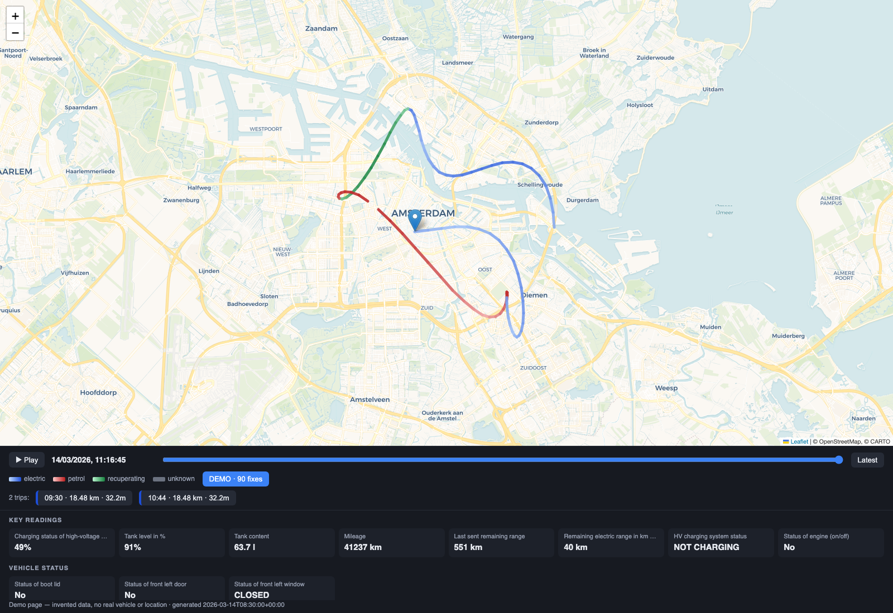

# bmw-cardata

Standalone subscriber for the BMW CarData streaming interface. Milestone 1:
land raw JSONL on disk. Storage (InfluxDB/Timescale) and Grafana come after.

## Portal prerequisites

1. My BMW → Personal Data → My Vehicles → CarData → **Create Client ID**.
   Do *not* click "Authenticate Vehicle".
2. **Subscribe the client ID to CarData Streaming** — this allocates the
   `cardata:streaming:read` scope. Must happen before running `auth`, otherwise
   the token comes back scopeless and MQTT rejects it with nothing useful in
   the error. `auth` checks for this and fails loudly.
3. **Change data selection** → enable the telematic keys you want. Nothing
   streams for keys that aren't selected.

## Use

```
.venv/bin/python -m bmwcd auth      # device-code flow, one-off
.venv/bin/python -m bmwcd status    # token state
.venv/bin/python -m bmwcd stream    # subscribe, append to data/raw/
```

During `auth`, finish the BMW login in the browser completely before touching
the terminal — interrupting the flow wedges the device code and it has to be
restarted.

## Running as a service

```
./launchd/install.sh
```

Installs two user LaunchAgents (idempotent — re-run after editing a plist):

- `nl.koczan.bmw-cardata.stream` — `RunAtLoad` + `KeepAlive`, so it starts at
  login and restarts on any exit. `ThrottleInterval` 30s stops a crash-loop
  hammering BMW when the refresh token has expired and needs `bmwcd auth` by hand.
- `nl.koczan.bmw-cardata.prune` — daily at 04:00.

Logs land in `data/logs/`. Check state with `launchctl list | grep bmw-cardata`.

**This does not survive sleep.** A LaunchAgent runs while you are logged in; it
does not keep the Mac awake. A closed lid means no data, and because the feed is
forward-only that gap can never be backfilled. For genuinely continuous capture
the service belongs on an always-on host — at which point remember BMW allows
only one stream connection per GCID, so it moves rather than being duplicated.

## Storage

PostgreSQL (`brew install postgresql@17`), plain — no Timescale. At a parked
car's message rate the hypertable machinery earns nothing, and retention is one
scheduled `DELETE`. Add Timescale later if volume ever justifies it; the schema
does not change.

`telemetry` is one row per `(vin, key, ts)`. Values land in a typed column —
`num`, `bool` or `txt` — because keys genuinely differ in type (of the first 277
messages: 99 int, 95 str, 74 bool, 9 float). That heterogeneity is why this is
not InfluxDB: Influx pins a field's type on first write and rejects the rest.

The primary key dedupes at write time. BMW re-sends identical readings — the
first capture had 277 messages carrying 168 distinct rows.

```
python -m bmwcd initdb   # idempotent
python -m bmwcd load     # backfill from raw JSONL, idempotent
python -m bmwcd prune    # apply retention_days + raw_retention_days
```

Two views ship with the schema:

- `location` — lat/lon/altitude/heading pivoted into points. Latitude and
  longitude arrive as *separate messages* but share an identical measurement
  timestamp, so this is an exact group-by, not an interpolation.
- `latest` — most recent value per key, for a dashboard header.

Replay for a time slider is a plain range scan:

```sql
SELECT ts, lat, lon FROM location
WHERE vin = $1 AND ts BETWEEN $2 AND $3
ORDER BY ts;
```

State as of an instant:

```sql
SELECT DISTINCT ON (key) key, ts, num, bool, txt, unit
FROM telemetry WHERE vin = $1 AND ts <= $2
ORDER BY key, ts DESC;
```

Raw JSONL stays the source of truth and outlives the database (`raw_retention_days`,
default 2x), so the DB can be dropped and rebuilt with `load` if the schema changes.

## Map

[](https://peterkoczan.github.io/bmw-cardata/demo.html)

*Click for the [live demo](https://peterkoczan.github.io/bmw-cardata/demo.html) — invented data, no real vehicle or location.*

```
python -m bmwcd export [--days N]
open data/viz/map.html
```

Regenerate the published preview after changing the template:

```
python tools/make_demo.py && tools/screenshot.sh
```

Leaflet page with all data embedded inline, so it works from `file://` without a
server — a browser will not `fetch()` a sibling JSON file off disk. Time slider
scrubs the vehicle to where it was at that instant and dims the route ahead of it.

Route colour encodes drivetrain mode: blue electric, red petrol, green
recuperating, with shade by intensity. Tracing the route with the cursor shows a
readout of that moment — speed, consumption, charge, fuel, odometer, heading,
altitude and fix quality. Below the map, a state panel shows every recorded key
as it stood at the slider's position.

**There is no exact speed in CarData.** BMW withholds it deliberately: "due to
privacy reasons some functions are not allowed to transmit the current driving
speed". The only speed signal is `vehicle.vehicle.speedRange.lowerBound` /
`.upperBound`, so the readout shows a band rather than a number.

**Mode is derived, not measured.** CarData exposes no instantaneous power or
fuel-flow signal anywhere in the catalogue — every consumption key is a lifetime
total, a per-trip accumulator or a running average. `avgAuxPower` looks like the
exception but covers auxiliary load only, not traction. So mode comes from engine
state, and shade from differencing state of charge or fuel level over the
distance between consecutive fixes. It is an estimate over a segment, not a
reading at a point.

Keys that matter, all confirmed streamable:

| Purpose | Key |
|---|---|
| State of charge | `vehicle.drivetrain.batteryManagement.header` |
| Battery capacity | `vehicle.drivetrain.batteryManagement.maxEnergy` |
| Engine running | `vehicle.drivetrain.engine.isIgnitionOn` / `.isActive` |
| Fuel | `vehicle.drivetrain.fuelSystem.level` (%), `.remainingFuel` (l) |
| Charging state | `vehicle.drivetrain.electricEngine.charging.hvStatus` |

Two traps in that list. BMW's catalogue has the *human-readable names* of the two
engine keys crossed over relative to their key names, so both are consulted and
either one reporting "running" wins. And `electricEngine.charging.level` looks
like SoC but is the *predicted* value and is not streamable at all.

Several keys BMW documents as `boolean` actually arrive as `ASN_isTrue` /
`ASN_isFalse` / `ASN_isUnknown`. The first two are normalised into the `bool`
column on write; unknown stays text-only, because mapping it to false would
invent a fact the car never reported.

Position updates depend on the instrument cluster, not the API: Live Cockpit
Professional emits roughly every 3 minutes or 2 km while moving, Live Cockpit
Plus only at trip start and end. Expect a coarse polyline either way. Fixes
reporting `NO_FIX`, null island, or out-of-range coordinates are dropped by the
`location` view.

## Catalogue

```
python -m bmwcd catalogue
```

BMW publishes the telematic data catalogue at a **public, unauthenticated**
endpoint — no CarData credentials involved. 294 keys, 245 of them streamable
(exactly the set the portal offers). Each carries a display name, unit,
datatype, value range and category, cached to `data/catalogue.json` and loaded
into the `catalogue` table for joining against `telemetry`.

It earns its place by typing values from BMW's metadata rather than from
whatever arrived first:

- **Numbers sometimes arrive quoted.** `batterySizeMax` came through as the
  string `"0.0"`. Typing on the Python type alone buried it in `txt`, invisible
  to every numeric query. Now `num` is populated too, with the raw text kept.
- **Many "boolean" keys ship bespoke vocabularies** — `OPEN/CLOSED`,
  `FLAP_UNLOCKED/FLAP_LOCKED`, `NOTCHOSEN/CHOSEN`. The mapping is derived from
  each key's own predicate (`isOpen` → `OPEN` is true), *not* from position in
  the range string: `isOpen` ships as both `CLOSED, OPEN, INVALID` and
  `OPEN, CLOSED, INVALID, UNKNOWN`, so positional derivation inverts half of
  them. Where polarity can't be established the value stays text — an unmapped
  value is still queryable, a wrong one is a lie.
- Keys with three or more real states (`isPermanentlyUnlocked` →
  `NO_ACTION, FLAP_UNLOCKED, FLAP_LOCKED`) are deliberately left alone.

## Reliability

The feed is forward-only, so every failure mode below costs data permanently.

- **Reconnect backs off** 5s doubling to 5 min, then 10 min after ten
  consecutive failures, seeded from the MQTT reason code — quota-exceeded waits
  60s, because reconnecting hard against a quota error is how you stay
  quota-exceeded.
- **A failed token refresh no longer kills the process.** `invalid_grant` is
  fatal and asks for `bmwcd auth`; network errors and 5xx back off and retry.
- **Connect has a timeout.** A wedged TLS handshake never fires a callback, so
  a blocking connect can hang forever with nothing to notice.
- **Database writes happen on their own thread** behind a bounded queue.
  Writing inline on paho's network thread meant a slow Postgres delayed PINGREQ
  past the 30s keep-alive and got us disconnected — a database problem becoming
  a data-loss problem. On overflow, messages are dropped and counted: the JSONL
  still has them and `bmwcd load` repairs the gap.
- **Tokens are written atomically.** BMW rotates the refresh token on every
  refresh; truncating in place meant a crash mid-write destroyed the only copy
  of a two-week credential.
- **A stall watchdog** rebuilds the connection if the broker holds the socket
  open but stops publishing. Default 6 hours, configurable — a parked car is
  legitimately silent for hours, so a short timer would churn all night.

## Remote control

There is none. Every CarData endpoint is a `GET` except `POST`/`DELETE` on
`/customers/containers`, which manages data selection rather than the car. No
location refresh, no remote functions. Those live on the separate, unofficial
MyBMW API that `bimmer_connected` speaks.

## Facts worth not relearning

- MQTT **v5.0**, TLS, port 9000, keep-alive ≤ 30s.
- Topic: **`{gcid}/+`**. The `id_token` carries the broker ACL in its
  `dynamic_scopes` claim as `read:streaming/*/{gcid}.*`, so a topic must begin
  with the GCID. The portal's connection panel shows the bare VIN as "Thema" —
  that is only the second component, and subscribing to it returns 0x87 Not
  authorized. BMW then drops the **entire connection**, so one speculative
  topic kills the working ones. Never probe topics on the live subscriber.
- Username is the GCID, password is the **`id_token`** (not the access token).
- `id_token` expires hourly → the stream loop tears down and rebuilds the
  connection each cycle rather than swapping credentials in place.
- Refresh token lasts ~2 weeks. Longer downtime than that means re-running `auth`.
- **One stream connection per GCID.** If Home Assistant should also get this
  data, this service has to republish to a local broker; HA cannot connect to
  BMW in parallel.
- The stream is forward-only. Location history accumulates here and cannot be
  backfilled from it — use the portal's Customer Archive export or the REST
  charging-history endpoint (rate limited to 50 req/24h).
- The i3 reports infrequently (typically parked/off or at 100% charge). Long
  silences are the vehicle, not the client.

## Sources

Endpoints confirmed against `whi-tw/bmw-cardata-streaming-poc` AUTHENTICATION.md
and `https://bmw-cardata.bmwgroup.com/customer/public/assets/swagger/swagger-customer-api-v1.json`.
